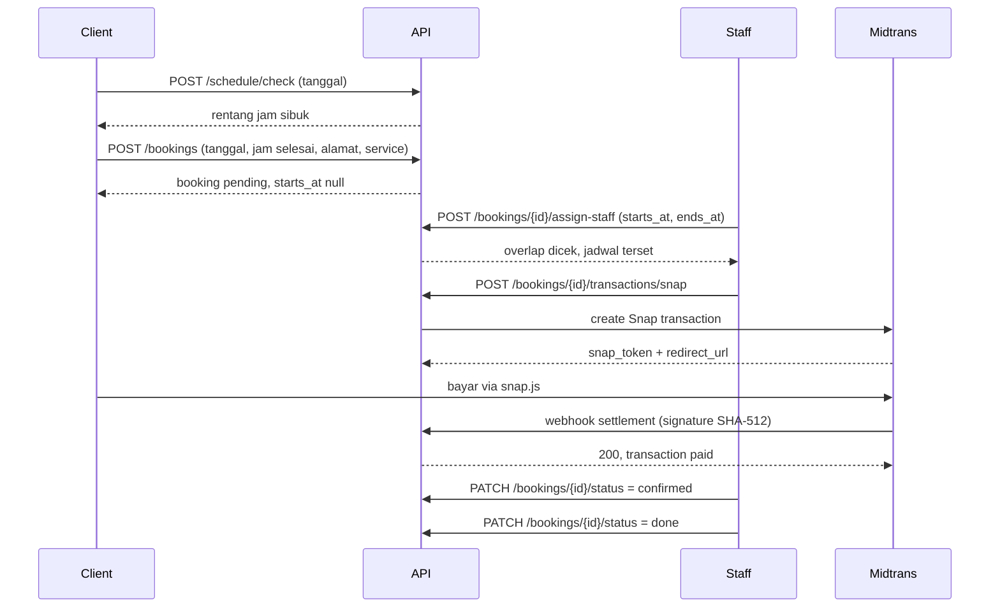

# SimpleBookingMUA

REST API booking Makeup Artist (MUA). Client publik mengusulkan tanggal, jam selesai, dan alamat; owner/admin/staff yang menentukan jam datang aktual, mengelola checklist kerja, dan menagih pembayaran lewat Midtrans Snap.

Backend Laravel 13, MySQL, autentikasi opaque bearer token, dokumentasi OpenAPI otomatis.

## Fitur

- **Booking publik tanpa akun** — client cukup isi tanggal, jam selesai usulan, alamat, dan service. Tidak boleh menyentuh jam mulai.
- **Penjadwalan oleh staff** — `starts_at` dan `ends_at` hanya bisa diisi `owner|admin|staff`, dengan proteksi overlap per staff yang aman terhadap race condition (row lock, diuji lewat proses paralel).
- **State machine booking** — `pending → confirmed → done`, `cancelled` sebagai terminal. Transisi ilegal ditolak `422`.
- **Katalog service + galeri** — banyak foto per service (upload atau URL eksternal), dijamin tepat satu cover per service di level database.
- **Checklist kerja** — task per booking dengan urutan dan penanda selesai.
- **Pembayaran Midtrans Snap** — create transaction, verifikasi signature SHA-512 webhook, pemrosesan idempotent, tidak bisa downgrade status yang sudah settlement.
- **Audit trail** — setiap aksi penting tercatat di `activity_logs` beserta snapshot `before`/`after`.
- **Swagger UI** — spec dihasilkan dari attribute PHP, bukan file YAML manual.

## Stack

| Komponen | Pilihan |
|---|---|
| Runtime | PHP 8.3+ |
| Framework | Laravel 13 |
| Database | MySQL 8+ (test suite jalan di SQLite in-memory) |
| Auth | Laravel Sanctum (bearer token, SPA stateful domains disabled) |
| Payment | Midtrans Snap |
| Docs | `darkaonline/l5-swagger` + attribute `OpenApi\Attributes` |
| Test | Pest 5 |
| Style | Laravel Pint |

## Arsitektur

Controller tipis, business logic di action class single-purpose, otorisasi di policy, serialisasi di API resource.

```
app/
├── Actions/          Business logic (satu class satu operasi)
│   ├── Bookings/     CreateBooking, UpdateBooking, AssignBookingSchedule, ChangeBookingStatus
│   ├── Transactions/ CreateSnapTransaction, HandleMidtransWebhook
│   ├── Services/     UpdateService, SaveServiceImage
│   ├── BookingTasks/ ManageBookingTask
│   ├── Users/        ManageUser
│   └── ActivityLogs/ RecordActivity
├── Contracts/        PaymentGateway (Midtrans di-swap saat test)
├── Http/
│   ├── Controllers/  HTTP + attribute OpenAPI
│   ├── Middleware/   AuthenticateSession (resolusi opaque token)
│   ├── Requests/     Validasi & guard field per-role
│   └── Resources/    Bentuk response JSON
├── Models/           Eloquent, UUID primary key
├── Policies/         Otorisasi berbasis role
└── Services/         Adapter integrasi eksternal
```

ERD lengkap, aturan bisnis, dan daftar deviasi yang disengaja ada di [`docs/erd-database.md`](docs/erd-database.md).

## Instalasi

```bash
git clone <url-repo> SimpleBookingMUA
cd SimpleBookingMUA/backend-mua

composer install
cp .env.example .env
php artisan key:generate
```

Buat database, lalu sesuaikan `.env`:

```env
DB_CONNECTION=mysql
DB_DATABASE=backend_mua
DB_USERNAME=root
DB_PASSWORD=

MIDTRANS_SERVER_KEY=SB-Mid-server-xxxxx
MIDTRANS_SNAP_URL=https://app.sandbox.midtrans.com
```

Migrasi dan seed:

```bash
php artisan migrate --seed
php artisan serve
```

Buka `http://127.0.0.1:8000` — otomatis redirect ke Swagger UI.

> **Jangan set `SESSION_DRIVER=database`.** Tabel `sessions` di project ini adalah tabel opaque auth token dari ERD, bukan tabel session Laravel. Driver `database` akan mencari kolom `payload` dan crash. `config/session.php` sudah hardcode `file` sebagai pengaman.

## Akun seed

Semua password `password123`.

| Username | Role |
|---|---|
| `owner` | owner |
| `admin` | admin |
| `staff1` | staff |
| `staff2` | staff |

`db:seed` tidak idempotent (username UNIQUE). Untuk reset: `php artisan migrate:fresh --seed`.

## Dokumentasi API

| Endpoint | Isi |
|---|---|
| `GET /api/documentation` | Swagger UI |
| `GET /docs` | Spec OpenAPI JSON |

Regenerate setelah mengubah attribute `OA\*`:

```bash
php artisan l5-swagger:generate
```

⚠️ **Docs tidak terproteksi.** `config/l5-swagger.php` memakai middleware kosong, jadi siapa pun yang bisa mencapai host dapat membaca seluruh permukaan API. Sebelum deploy, gate di belakang middleware `auth.session` atau batasi ke environment lokal.

## Autentikasi

Login mengembalikan token acak 64 karakter yang disimpan di tabel `sessions`. Tidak ada JWT — token opaque di database sudah cukup dan bisa dicabut seketika.

```bash
curl -X POST http://127.0.0.1:8000/api/login \
  -H 'Accept: application/json' \
  -d 'username=owner&password=password123'
```

```json
{
  "token": "9x1kQ...",
  "expires_at": "2026-09-06T00:00:00.000000Z",
  "user": { "id": "...", "name": "Owner", "role": "owner" }
}
```

Kirim di setiap request terproteksi:

```
Authorization: Bearer 9x1kQ...
```

Session dianggap valid bila `revoked_at` null, `expires_at` belum lewat, dan user `is_active`. `POST /api/logout` mengisi `revoked_at`.

## Endpoint utama

**Publik**

| Method | Path | Fungsi |
|---|---|---|
| `POST` | `/api/login` | Login |
| `GET` | `/api/services` | Daftar service aktif |
| `GET` | `/api/services/{service}` | Detail service + foto |
| `POST` | `/api/schedule/check` | Lihat jam sibuk di suatu tanggal |
| `POST` | `/api/bookings` | Ajukan booking (`starts_at` selalu null) |
| `POST` | `/api/webhooks/midtrans` | Notifikasi Midtrans (signature-verified) |

**Terproteksi** (`Authorization: Bearer`)

| Method | Path | Fungsi |
|---|---|---|
| `GET` | `/api/user` | User yang sedang login |
| `POST` | `/api/logout` | Cabut token |
| `GET·POST·PATCH·DELETE` | `/api/users[/{user}]` | Manajemen user (owner/admin) |
| `POST·PATCH·DELETE` | `/api/services[/{service}]` | Kelola service (owner/admin) |
| `POST·PATCH·DELETE` | `/api/services/{service}/serviceImages[/{image}]` | Kelola foto service |
| `GET·PATCH·DELETE` | `/api/bookings[/{booking}]` | Kelola booking |
| `POST` | `/api/bookings/{booking}/assign-staff` | Set staff + `starts_at`/`ends_at` |
| `PATCH` | `/api/bookings/{booking}/status` | Ubah status |
| `POST·PATCH·DELETE` | `/api/bookings/{booking}/bookingTasks[/{task}]` | Checklist kerja |
| `GET` | `/api/bookings/{booking}/transactions` | Riwayat pembayaran |
| `POST` | `/api/bookings/{booking}/transactions/snap` | Buat Snap transaction |
| `GET` | `/api/activity-logs[/{log}]` | Audit trail (owner/admin) |

Daftar lengkap: `php artisan route:list --path=api`.

## Alur booking



## Aturan bisnis yang dijaga

- `client_requested_date`, `client_requested_end_time`, `client_requested_ends_at` **immutable** setelah create — jejak usulan client.
- `starts_at` hanya bisa diisi role internal. API publik menolak dengan `422`, bukan diam-diam membuang field.
- Satu staff tidak bisa double-book. Cek overlap berjalan di dalam transaksi dengan row lock.
- `ends_at > starts_at` dijaga CHECK constraint di MySQL.
- Tepat satu `is_cover` per service — trigger MySQL (partial unique index di SQLite).
- Service dengan booking aktif tidak bisa dinonaktifkan.
- `gross_amount > 0`, `order_id` UNIQUE maksimal 50 karakter.
- Webhook Midtrans: signature diverifikasi **sebelum** lookup `order_id`, supaya tidak membocorkan keberadaan order ke pemanggil anonim.
- Transaksi yang sudah `settlement`/`capture` tidak bisa didowngrade oleh webhook lama.

## Testing

```bash
cd backend-mua
php artisan test
```

Default berjalan di SQLite in-memory. Beberapa test spesifik MySQL (CHECK constraint, trigger cover, concurrency) akan di-skip.

Untuk menjalankannya, siapkan database **terpisah** — suite memakai `RefreshDatabase` dan akan menghapus seluruh data:

```bash
DB_CONNECTION=mysql DB_DATABASE=backend_mua_test php artisan test
```

Style check:

```bash
vendor/bin/pint --test
```

## Status

119 test lulus, 612 assertion, Pint bersih di 125 file. Seluruh 15 phase compliance ERD selesai — rinciannya di [`docs/backend-erd-compliance-todo.md`](docs/backend-erd-compliance-todo.md).

Belum ada: frontend, refund flow, notifikasi WhatsApp/email, ownership scoping booking per staff (setiap user aktif saat ini bisa mengubah booking mana pun).

## Struktur repo

```
SimpleBookingMUA/
├── backend-mua/    Aplikasi Laravel
└── docs/           ERD, aturan bisnis, checklist compliance
```

## Lisensi

MIT.
