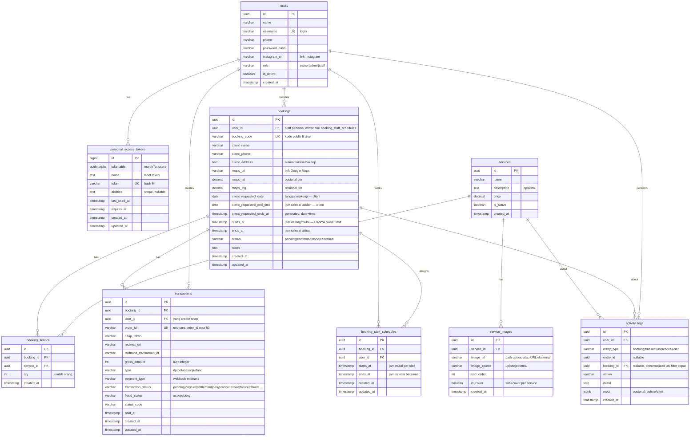

# SimpleBookingMUA — ERD



## Relasi

| Dari | Ke | Kardinalitas | Arti |
|---|---|---|---|
| `users` | `personal_access_tokens` | 1—N | token login Sanctum |
| `users` | `bookings` | 1—N | staff handle booking |
| `services` | `booking_service` | 1—N | jasa yg dipesan (via pivot) |
| `bookings` | `booking_service` | 1—N | layanan + qty per booking |
| `bookings` | `booking_staff_schedules` | 1—N | staff yang ditugaskan + jam mulai masing-masing |
| `users` | `booking_staff_schedules` | 1—N | jadwal kerja per staff |
| `services` | `service_images` | 1—N | foto jasa (upload atau link) |
| `bookings` | `transactions` | 1—N | bayar Snap per booking |
| `users` | `transactions` | 1—N | yang create Snap |
| `users` | `activity_logs` | 1—N | siapa lakukan aksi |
| `bookings` | `activity_logs` | 0—N | log terkait booking |

---

## Jadwal: client usul selesai, staff isi jam mulai

MUA **tidak** punya jam operasional tetap. **Tidak ada duration di service** — rentang kerja ditentukan staff lewat `starts_at` / `ends_at`.

| Siapa | Bisa | Field |
|---|---|---|
| Client (publik) | Usul **tanggal** makeup + jam **selesai** + alamat | `client_requested_date`, `client_requested_end_time`, alamat/maps |
| Client | **Tidak** isi / edit jam mulai | — |
| Owner / admin / staff | Isi & edit jam datang/mulai + selesai aktual; boleh koreksi alamat | `starts_at`, `ends_at`, `user_id`, alamat/maps |

- `client_requested_*` **immutable** setelah create (jejak usulan client)
- `starts_at` **null** sampai owner/staff isi
- `ends_at` default = `client_requested_ends_at` saat create; staff boleh sesuaikan
- Setiap set/ubah jadwal staff → `activity_logs` action `booking.schedule_adjusted`

### Default create dari usulan client
```
client_requested_date     = (input client — tanggal makeup)
client_requested_end_time = (input client — jam selesai)
client_requested_ends_at  = date + time
client_address = (wajib)
maps_url / maps_lat/lng = (opsional)
ends_at    = client_requested_ends_at
starts_at  = NULL
user_id    = null / assign staff
status     = pending
```

### Saat staff set jam
```
starts_at  = (input staff)     -- jam datang/mulai
ends_at    = (input staff)     -- jam selesai aktual (boleh = atau ≠ usulan client)
-- re-validasi overlap
```

---

## Validasi ketersediaan jadwal

### Saat create (client — belum ada `starts_at`)
1. **Service aktif** — `services.is_active = true`
2. **`client_requested_date` + `client_requested_end_time` wajib** → `client_requested_ends_at`
3. **`client_requested_ends_at > now()`**
4. **`client_address` tidak kosong**
5. Pin maps: kalau lat/lng terisi, keduanya ada + range valid
6. **Tidak ada hard block overlap di create** — client belum punya window mulai. Cukup tampilkan busy existing (lihat § cek jadwal) agar client sadar

### Saat staff set/edit `starts_at` / `ends_at`
1. **Hanya** role ∈ `owner|admin|staff` yang boleh set `starts_at`
2. **`starts_at` NOT NULL** dan **`ends_at > starts_at`**
3. **Staff aktif** kalau `user_id` terisi
4. **Tidak overlap** per staff (`starts_at` existing NOT NULL, status ∈ `pending|confirmed`):
   - `existing.starts_at < new.ends_at AND new.starts_at < existing.ends_at`
5. Ideal: `confirmed` butuh `starts_at` + `ends_at` sudah diisi staff

Gagal → tolak write; opsional log `booking.rejected`.

---

## Cek jadwal (client / publik)

Client cek **tanggal** — lihat jam yang sudah diisi staff. Tanpa duration service; tidak hitung estimasi window mulai.

### Input cek
- `client_requested_date` (wajib)
- `user_id` staff (opsional)

### Lihat busy di tanggal
```sql
SELECT starts_at, ends_at
FROM bookings
WHERE status IN ('pending', 'confirmed')
  AND starts_at IS NOT NULL
  AND starts_at::date = :date
  AND (:user_id IS NULL OR user_id = :user_id)
ORDER BY starts_at;
```

- Kosong → tanggal belum ada jadwal final (masih bisa usul)
- Ada row → tampil rentang sibuk; client tetap boleh usul (staff yang putuskan/assign)

### Input create booking
- `client_requested_date`, `client_requested_end_time`
- `services[{id, qty}]`, `client_name`, `client_phone`
- `client_address` (wajib)
- `maps_url`, `maps_lat`, `maps_lng` (opsional)

### Contoh
Client pilih tanggal `2026-08-10`, selesai `15:00`.
Busy tertera: `10:00–12:00`, `14:00–16:00` (dari booking yang sudah di-set staff).
Booking create: `starts_at = NULL`, `ends_at = 2026-08-10 15:00`.
Staff set datang `12:30`, selesai `15:00` → overlap dicek saat staff save.

### Index
- `(user_id, starts_at)` di `bookings`

---

## Konsistensi data antar relasi

### FK & cascade
| Child | Parent | ON DELETE |
|---|---|---|
| `personal_access_tokens.tokenable_id` | `users` (morph) | CASCADE |
| `bookings.user_id` | `users` | RESTRICT |
| `service_images.service_id` | `services` | CASCADE |
| `booking_service.booking_id` | `bookings` | CASCADE |
| `booking_service.service_id` | `services` | RESTRICT |
| `booking_staff_schedules.booking_id` | `bookings` | CASCADE |
| `booking_staff_schedules.user_id` | `users` | RESTRICT |
| `transactions.booking_id` | `bookings` | RESTRICT |
| `transactions.user_id` | `users` | RESTRICT |
| `activity_logs.user_id` | `users` | RESTRICT |
| `activity_logs.booking_id` | `bookings` | SET NULL |

### Aturan bisnis (app + constraint DB)
| Rule | Cara jaga |
|---|---|
| `order_id` unik | UNIQUE |
| `qty > 0` per booking_service | app guard (`integer, min:1`) |
| Pair unik `(booking_id, service_id)` di pivot | UNIQUE |
| Pair unik `(booking_id, user_id)` di `booking_staff_schedules` | UNIQUE + `distinct` di request |
| Satu staff tidak double-book | cek overlap per staff di `booking_staff_schedules` saat assign, row lock dalam transaksi |
| Semua staff satu booking pakai `ends_at` sama | app guard di `AssignBookingSchedule` |
| `booking_code` unik | UNIQUE + retry loop saat generate |
| `ends_at > starts_at` saat `starts_at` terisi | CHECK |
| `ends_at > starts_at` di `booking_staff_schedules` | CHECK (MySQL) + app guard |
| Usulan client (`date`/`end_time`/`ends_at`) immutable setelah create | app guard |
| `starts_at` hanya owner/admin | app guard |
| Client tidak write `starts_at` | API publik reject |
| Edit jadwal staff | log `booking.schedule_adjusted` |
| `gross_amount > 0` | CHECK |
| Transaksi hanya booking non-cancelled | app guard |
| `confirmed` butuh settlement Snap (+ idealnya `starts_at` terisi) | app guard |
| `done` hanya dari `confirmed` | state machine |
| `cancelled` tidak buat Snap baru | app guard |
| Nonaktifkan service yang masih booking aktif | RESTRICT / app |
| Role ∈ `owner\|admin\|staff` | CHECK |

### Activity log
| action | kapan |
|---|---|
| `booking.created` / `booking.updated` / `booking.status_changed` | booking |
| `booking.schedule_adjusted` | staff ubah `starts_at`/`ends_at` |
| `booking.rejected` | gagal validasi |
| `transaction.created` / `transaction.webhook` | Snap |
| `user.created` / `user.updated` / `user.deactivated` | user mgmt |

---

## Catatan Midtrans Snap

- Backend: `POST /snap/v1/transactions` → `order_id`, `snap_token`, `redirect_url`
- Frontend: `snap.js` + `snap.pay(token)`
- Status final dari **webhook**
- Siklus: `pending` → `settlement` / `expire` / `deny` / `cancel` / …
- `order_id` unik max 50; `gross_amount` integer IDR

### Flow booking + bayar
1. Client isi tanggal + jam selesai + alamat/maps + service → lihat busy → booking `pending` (`starts_at` null)
2. Staff isi `starts_at` + `ends_at`, assign `user_id` → cek overlap
3. Create Snap → `transactions` `pending`
4. Webhook `settlement` + `fraud_status=accept` → boleh `confirmed`
5. Selesai kerja → `done`

---

## Catatan umum

- `users` = tim internal (`owner` \| `admin` \| `staff`)
- Auth: Laravel Sanctum — `personal_access_tokens` (morphTo `users`, token hash 64, `expires_at` 30 hari)
- Login: `username` + `password_hash` → buat row `personal_access_tokens`
- Auth request: header `Authorization: Bearer <token>` → middleware `AuthenticateSession` cari token aktif (`expires_at > now()`, user `is_active`)
- Logout: hapus row token
- Skip JWT — opaque token Sanctum di DB cukup; ganti JWT kalau stateless scale butuh
- `users.instagram_url` — opsional
- `services`: name, description (opsional), price — **tanpa duration**; foto di `service_images` (1—N, upload atau link eksternal, satu `is_cover`)
- `booking_service`: pivot booking ↔ service dengan `qty` (jumlah orang); pair `(booking_id, service_id)` unik
- Durasi aktual = `ends_at - starts_at` setelah staff set
- Client di `bookings`: tanggal, jam selesai usulan, alamat, maps
- `starts_at` hanya owner/staff
- Index: `(user_id, starts_at)` bookings; `(booking_id, service_id)` booking_service; `order_id` transactions; `(entity_type, entity_id)` logs

---

## Deviasi implementasi yang disengaja

ERD di atas adalah spesifikasi target. Backend Laravel (`backend-mua/`) sengaja berbeda pada titik-titik berikut.

| Bagian ERD | Implementasi | Alasan |
|---|---|---|
| `sessions` (opaque token table) | Laravel Sanctum `personal_access_tokens` (morphTo, bigint id, hash token) | Sanctum adalah standar Laravel untuk API token; tidak perlu reinvent |
| `client_requested_ends_at` "generated: date+time" | Kolom `timestamp` biasa, dihitung di `CreateBooking` | MySQL generated column tidak bisa dipakai bersama FK yang dibutuhkan di tabel yang sama (error 1215) |
| `activity_logs.user_id` FK wajib | Nullable | Booking publik tidak punya actor, tapi `booking.created` tetap harus tercatat |
| CHECK `ends_at > starts_at`, `gross_amount > 0`, `role IN (...)` | Dibuat hanya saat driver MySQL | SQLite (koneksi test default) tidak mendukung `ALTER TABLE ADD CONSTRAINT`; validasi setara ada di Form Request + Action |
| `is_cover` "satu cover per service" | MySQL: trigger `service_images_one_cover_insert/update` dengan lock parent row. SQLite: partial unique index | Generated column + FK bentrok di MySQL |
| `DELETE` user | Soft deactivate (`is_active = false`) + log `user.deactivated` | FK RESTRICT ke `bookings`/`transactions`/`activity_logs` membuat physical delete selalu gagal |
| `DELETE` booking | Soft cancel (`status = 'cancelled'`) | Jejak booking + transaksi harus tetap ada |
| `booking.rejected` | Tidak diimplementasikan | ERD menandainya opsional; penolakan sudah jadi `422` tanpa side effect |
| `service.*` activity action | Tidak ada | Tidak terdaftar di tabel action ERD |
| `transactions.type` `dp\|pelunasan\|refund` | Selalu `'dp'` saat create Snap | Belum ada endpoint pelunasan/refund; kolom sudah siap |
| `activity_logs.user_id` untuk `transaction.webhook` | `null` | Actor adalah Midtrans, bukan user internal |
| Cek jadwal | `POST /api/schedule/check` | Butuh body tervalidasi; secara semantik read-only |
| `bookings.service_id` diganti pivot `booking_service` | `bookings` tidak lagi punya kolom `service_id`; relasi M:N via `booking_service` dengan `qty` | Multi-service + quantity per booking |
| `booking_tasks` (checklist kerja) | Dihapus dari aplikasi | Fitur dicabut; migration `2026_08_16_000003_drop_booking_tasks_table` men-drop tabel dan membersihkan log `entity_type = 'task'` |
