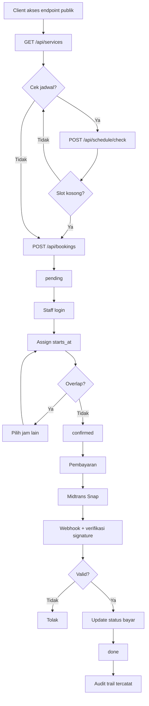
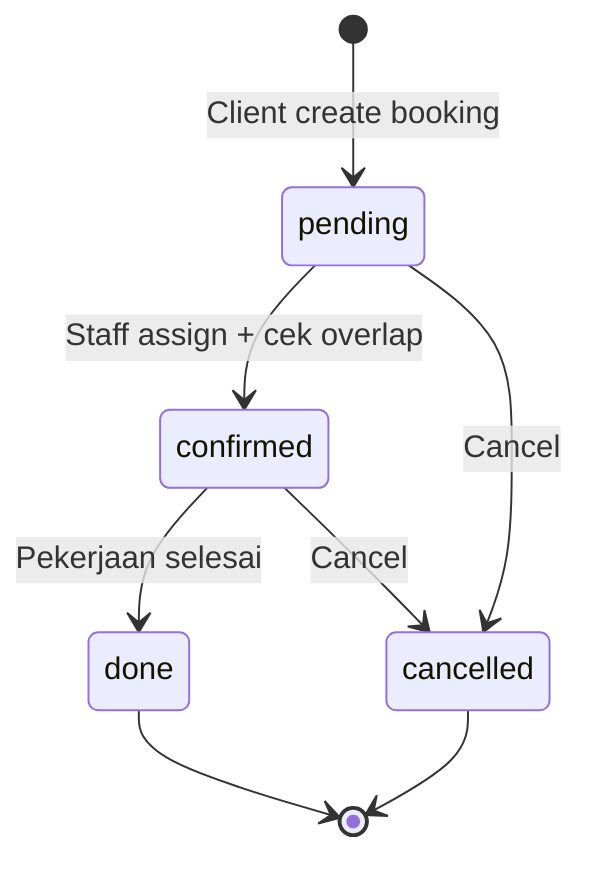

# SimpleBookingMUA — Presentasi Final Project (PPT Outline)

> Catatan: Rencana keseluruhan = full-stack **Laravel + React**. Pada checkpoint ini **backend (Laravel REST API) selesai & dapat dievaluasi**; **frontend React = fase berikutnya, belum diimplementasikan**.

---

## Slide 1 — Introduction

### Self-Overview
- **Julio Rohmatulloh Hardiansyah** — Full Stack Web Developer.
- Minat: backend terstruktur, aman, efisien.
- Prinsip: kode harus berjalan, mudah dipelihara, terdokumentasi, teruji.
- Tujuan karir: merancang arsitektur sistem produksi-grade (database → business logic → integrasi pihak ketiga).

### Education
- **Gelar:** _(diisi)_
- **Institusi:** _(diisi)_
- **Tahun:** _(diisi)_
- **Spesialisasi:** _(diisi)_

### Working Experience
- **Peran:** _(diisi)_
- **Perusahaan:** _(diisi)_
- **Periode:** _(diisi)_
- **Tanggung Jawab & Proyek:** _(diisi)_
- **Pencapaian:** _(diisi)_

---

## Slide 2 — Overview Project

- **SimpleBookingMUA** — REST API booking Makeup Artist (MUA) dengan Laravel.
- Final Project Dibimbing Bootcamp — Full Stack Web Developer.
- Fase backend selesai; frontend React fase berikutnya.

**Capaian backend:**
- REST API terstruktur + dokumentasi OpenAPI otomatis.
- RBAC 4 tipe pengguna.
- Penjadwalan anti-race condition (row lock).
- Integrasi Midtrans + verifikasi webhook.
- Audit trail otomatis.
- Test suite Pest.

---

## Slide 3 — Background & Problem

**Kondisi:** MUA/studio masih booking manual via WhatsApp/DM, catatan terpisah, ingatan staff.

**Masalah utama:**
- Jadwal tabrak → double-booking.
- Client bebas set jam mulai → seharusnya MUA yang tentukan.
- Transaksi & status bayar sulit dilacak.
- Pembayaran manual → human error.

**Tujuan:** Sistem terintegrasi otomatisasi pemesanan → penjadwalan → eksekusi → pembayaran.

---

## Slide 4 — Target Pengguna

| Pengguna | Peran |
|---|---|
| Owner | Pemilik, akses penuh manajemen |
| Admin | Kelola user & service |
| Staff (MUA) | Eksekusi booking |
| Client (publik) | Pesan tanpa akun |

**Model bisnis:** B2B + B2C.

---

## Slide 5 — Fitur Kunci

- Client pesan publik tanpa akun (tanggal, jam selesai usulan, alamat, service).
- **MUA yang tentukan jam datang aktual** (`starts_at`) — client dilarang set jam mulai.
- Cek overlap jadwal per staff otomatis (row lock, anti race condition).
- State machine: `pending → confirmed → done` (`cancelled` = terminal).
- Pembayaran Midtrans Snap + verifikasi signature webhook.
- Audit trail: setiap aksi tercatat di `activity_logs` (snapshot before/after).

---

## Slide 6 — Alur Booking



---

## Slide 7 — State Machine Booking



---

## Slide 8 — Tech Stack & Alasan

| Komponen | Pilihan | Alasan (singkat) |
|---|---|---|
| Runtime | PHP 8.3+ | Modern, cepat, typed properties |
| Framework | Laravel 13 | REST API + Eloquent + middleware + validasi bawaan |
| Database | MySQL 8+ | ACID, trigger, CHECK constraint → integritas transaksi |
| Auth | Sanctum | Bearer token sederhana, cocok untuk API stateless |
| Payment | Midtrans Snap | Gateway lokal populer + webhook signature SHA-512 |
| Docs | l5-swagger + OpenAPI attribute | Swagger otomatis dari kode, bukan YAML manual |
| Test | Pest 5 | Ekspresif, modern, minim boilerplate |
| Style | Laravel Pint | Format konsisten otomatis |

**Mengapa Laravel?** Ecosystem lengkap (ORM, migration, validasi, Policy, Sanctum) + convention over configuration → cepat build API terstruktur.

**Mengapa MySQL?** Butuh trigger + CHECK constraint untuk jaminan integritas di level DB (satu cover per service, role valid).

**Mengapa Sanctum (bukan JWT)?** Token opaque di DB → bisa revoke kapan saja + cek `is_active` per request → cocok untuk kebutuhan audit & nonaktifkan user.

**Mengapa Midtrans?** Payment gateway Indonesia, dukungan Snap token + webhook + signature → integrasi aman & familiar.

---

## Slide 9 — Arsitektur Sistem

```
app/
├── Actions/          Business logic (CreateBooking, AssignBookingSchedule, dll)
├── Contracts/        PaymentGateway (di-swap saat test)
├── Http/
│   ├── Controllers/  HTTP + attribute OpenAPI
│   ├── Middleware/   AuthenticateSession
│   ├── Requests/     Validasi & guard field per-role
│   └── Resources/    Bentuk response JSON
├── Models/           Eloquent, UUID PK
├── Policies/         Otorisasi berbasis role
└── Services/         Adapter integrasi eksternal
```

**Prinsip:** Controller tipis → logic di Action class → otorisasi di Policy → response di Resource → integrasi di Service (di belakang Contract).

---

## Slide 10 — Detail Website

**Status UI:** Frontend React belum diimplementasikan pada checkpoint ini → wireframe/mockup menyusul fase frontend.

**Dokumentasi visual tersedia:**
- Swagger UI: `GET /api/documentation`
- OpenAPI JSON: `GET /docs`

**Endpoint publik utama:**

| Method | Endpoint | Fungsi |
|---|---|---|
| `POST` | `/api/login` | Autentikasi staff/owner/admin |
| `GET` | `/api/services` | Lihat katalog service |
| `POST` | `/api/bookings` | Buat booking (publik) |
| `POST` | `/api/schedule/check` | Cek ketersediaan jadwal |

---

## Slide 11 — Proses Development

1. **Perencanaan** — masalah, target user, state machine, skema DB.
2. **Desain** — arsitektur Controller–Action–Policy–Resource + Contract payment.
3. **Pengembangan** — model, migration, Action, middleware, Policy, Resource, Service Midtrans.
4. **Pengujian** — Pest: feature test, race condition paralel, webhook signature, authorization.
5. **Peluncuran** — Swagger UI + seed data demo.

---

## Slide 12 — Issue & Problem Solving

| Masalah | Solusi |
|---|---|
| Akses per role (client tidak boleh set jadwal sendiri) | Policy berbasis role + guard field di Form Request |
| Double-booking (race condition) | `lockForUpdate` di transaksi DB + test paralel |
| Client manipulasi `starts_at` | Field `prohibited` di Request → tolak `422` |
| >1 cover per service | Trigger MySQL / partial unique index SQLite di level DB |
| Webhook dipalsukan / status di-downgrade | Verifikasi signature SHA-512 sebelum lookup + idempotent + no-downgrade |
| User nonaktif masih bisa akses | Middleware `AuthenticateSession` cek `is_active` per request |
| Tidak ada jejak aksi | Audit trail `activity_logs` otomatis (snapshot before/after) |

---

## Slide 13 — Tautan & Demo

- **GitHub:** SimpleBookingMUA (backend-mua)
- **Swagger:** `GET /api/documentation`
- **OpenAPI JSON:** `GET /docs`
- **Akun seed (password `password123`):** `owner`, `admin`, `staff1`, `staff2`

**Endpoint demo:** `POST /api/login`, `GET /api/services`, `POST /api/bookings`, `POST /api/schedule/check`
